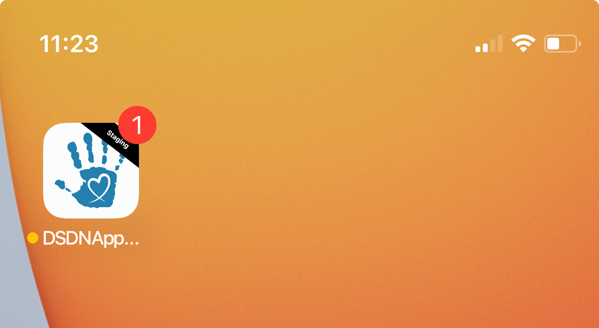

# FirebaseClient

Ruby gem with FCM support: easily sends push notifications to Firebase for smooth mobile device communication

## Installation

1. Add this gem to your `Gemfile`
```shell
gem 'firebase_client', github: 'gojilabs/firebase_client', tag: '<latest tag>'
```
2. Install gem
```shell
bundle install
```
3. Generate initializer:
```shell
rails generate firebase_client:install
```
4. Open initializer `config/initializers/firebase_client.rb`
- set Firebase settings
- add logic to handle canonical IDs
- add logic to handle not registered IDs

## Usage

### Send push notification
```ruby
# @param device_token [String] Firebase device token (registration ID)
# @param title [String] notification title
# @param body [String] notification body
# @param data [Hash] hash with additional internal data that should be send within push notification (values must have String type)
# @return [Hash] Firebase response
# @param ios_sound [String] (Optional) iOS sound
# @param android_sound [String] (Optional) Android sound
# @param badge [Integer] (Optional) unread push notifications count
::FirebaseClient::Messages::SendService.call(device_token:, title:, body:, data:)

# An example:
::FirebaseClient::Messages::SendService.call(
  device_token: 'eck6zE4RAUDbnYnrFL_oPG:APA91bF6zpYgLcjLtcADhgbF3...', 
  title: 'Hello world!',
  body: 'This is push notification content',
  data: {user_id: '123', environment: 'staging'}
)
```

### iOS mobile app icon badge



#### Update badge
```ruby
# @param device_token [String] Firebase device token (registration ID)
# @param badge [Integer] unread push notifications count
::FirebaseClient::IosBadge::UpdateService.call(device_token:, badge:)

# An example:
::FirebaseClient::IosBadge::UpdateService.call(
  device_token: 'eck6zE4RAUDbnYnrFL_oPG:APA91bF6zpYgLcjLtcADhgbF3...', 
  badge: 7
)
```

#### Remove badge
```ruby
# @param device_token [String] Firebase device token (registration ID)
::FirebaseClient::IosBadge::RemoveService.call(device_token:)

# An example:
::FirebaseClient::IosBadge::RemoveService.call(device_token: 'eck6zE4RAUDbnYnrFL_oPG:APA91bF6zpYgLcjLtcADhgbF3...')
```

## Development

Feel free to improve something, add more unit test or extend this gem with new logic.
Steps to do this:
- open PR
- test your code, confirm that it does not break existing functionality
- bump gem version in your PR
- once it will be merged, on the main branch - create a new tag with your version, create a release
